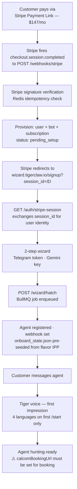

# What Tiger Claw Does

## The One-Sentence Version

Tiger Claw is an AI agent that hunts for qualified prospects 24/7 and books them into the operator's calendar for zoom or other online meetings— so the operator wakes up with meetings, not leads.

---

## The Designed Experience (Vision — Not All Live Yet)

This is what the platform is being built to do. Items marked ⚠️ are not yet live.

### Signup — Stripe → 2-Step Wizard ✅ Live

Customer pays via Stripe Payment Link ($147/mo). Stripe redirects to `wizard.tigerclaw.io/signup?session_id={ID}`. Operator name comes from Stripe automatically.

The wizard is a single scrolling page with 2 steps:
1. **Connect your Telegram bot** — BotFather instructions + token input (AES-256-GCM encrypted)
2. **Add your AI key** — Gemini API key from aistudio.google.com

That's it. Bot defaults to "Tiger." IPP pre-seeded from flavor config (`network-marketer`). No interview, no name field, no ICP questions. One operator-facing flavor.

### After Signup
The agent hatches immediately — calibrated, hunting-ready, no interview. ✅ Live (PR #255)

First message from a prospect: 4-language greeting. After that, agent mirrors the prospect's language. ✅ Live (PR #261)

The operator sets their availability: one or two Zoom slots per day. ⚠️ Calendar UI not yet built. Cal.com URL must be set manually in settings.json for now.

### Every Day After That
- Agent hunts for qualified prospects using the Data Mine ✅ Mine running
- Agent engages publicly, drives inbound ⚠️ Tiger Strike Engage not yet wired
- Agent qualifies in conversation ✅ Built
- When a prospect is ready: agent offers a Zoom slot and books it ⚠️ Cal.com booking not yet built
- Operator shows up to the Zoom and closes the deal

### The Deliverable
**Booked calls.** Not leads. Not conversations. Not CRM entries. A human being on a Zoom at a specific time, already warmed up, already interested.

---

## Current Reality (2026-04-07)

| Item | State |
|------|-------|
| Agent hatches calibrated, no interview | ✅ Live — PRs #255, #317 |
| Wizard — 2 steps (token + key) | ✅ Live — 1 flavor (network-marketer), Stripe payment gate closed |
| First impression in 4 languages | ✅ Live — PR #261. Fires on first `/start` per chatId, language-matched after. |
| Cal.com Zoom booking | ✅ Built — `tiger_book_zoom` registered. Needs `calcomBookingUrl` set to activate. |
| Tiger Strike Engage wired to mine | ✅ Wired — PR #261. Fires after 2 AM mine cycle. |
| Stripe Payment Link | ✅ Live — $147/mo. Paddle deleted (PR #314). |
| Scout run for any real tenant | ⚠️ Never triggered in production |
| Real prospect conversation | ⚠️ Zero — only operator has messaged |

---

## The Agent's Mission (NM Flavor)

**Goal:** A booked Zoom appointment — or, eventually, a closed sale.

Hunt for people showing signs of:
- Dissatisfaction with their current income
- Interest in a side income or business opportunity
- Open to a conversation about financial independence

Qualify them in natural conversation. When intent is clear: offer one Zoom slot. Get the yes. Book it. Report to operator.

The agent does not close. The agent gets the prospect to the 1-yard line. The operator punches it in on the call.

---

## What the Agent Can Do

The Telegram channel is just the tunnel — the intelligence behind it is a full agent with a working skillset.

| Skill | What It Does |
|-------|-------------|
| **Hunt** | Scans public signals daily for people expressing intent matching the ICP. Finds them before they find you. |
| **Reach** | Finds prospects on public forums. Drafts a contextual reply and generates a one-click Web Intent URL. Operator clicks once — it posts from their real account. No auto-posting, no bot risk. |
| **Qualify** | Holds natural conversation. Scores intent in real time. Knows when someone is ready and when they're not. |
| **Handle objections** | Trained on the specific objections for each flavor. Doesn't fold. Doesn't push. Moves the conversation forward. |
| **Remember** | Carries context across every conversation. Knows what was said, what was agreed, what the next step is. |
| **Book** | When a prospect qualifies, offers a Zoom slot and books it directly on the operator's calendar. |
| **Nurture** | Follows up with prospects who weren't ready. Checks back in. Keeps the relationship warm without the operator lifting a finger. |
| **Report** | Sends the operator a daily brief: facts mined, conversations active, appointments booked. |

The agent runs 24/7. It does not sleep, forget, or have a bad day.

---

## What the Platform Is NOT

- Not a CRM. Operators don't manage contacts.
- Not a chatbot that waits for inbound. It hunts.
- Not a complex setup. Stripe checkout → 2-step wizard → live bot.
- Not configurable IPP — the flavor already knows the prospect better than the operator does.

---

## Payment Flow — Stripe (Live)

**Payment gate is closed.** `/signup` without `session_id` redirects to landing page. Paddle deleted (PR #314). Stan Store dead code still present.

---

## The Architecture That Makes It Work

| Layer | What It Does |
|-------|-------------|
| Data Mine | Runs at 2 AM UTC daily. 8 Research Agents in parallel. 1,500+ facts per run. Identifies intent signals by region and flavor. Suggests top-of-funnel sources per region. |
| Scout | Per-tenant. Finds prospects on the platforms most active in the operator's region. |
| Agent | Starts conversations, handles objections, qualifies. Runs 24/7. ✅ Live |
| Tiger Strike | Drafts replies to public posts where prospects are talking. Generates one-click Web Intent URLs. Operator clicks → posts from their account. ✅ Wired to mine cycle (PR #261). Verify after next 2 AM run. |
| Reporting | Daily brief: facts mined, top sources by region. ✅ Live (admin only) |
| Calendar / Booking | Operator sets 1–2 daily Zoom slots. Agent fills them. ⚠️ Not yet built |

---

## The Sale

The operator pays because they wake up with Zoom calls booked. That is a clear, provable ROI.

$147/month to have your calendar filled with qualified prospects is not a hard sell to someone who has been manually prospecting for years.
