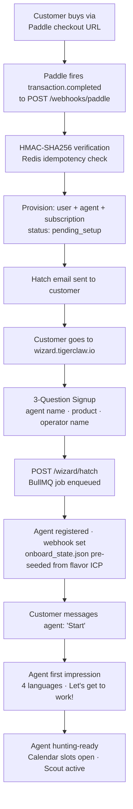

# What Tiger Claw Does

## The One-Sentence Version

Tiger Claw is an AI agent that hunts for qualified prospects 24/7 and books them into the operator's calendar — so the operator wakes up with meetings, not leads.

---

## The Operator Experience

### Signup — 3 Questions Only

1. **Agent name** — what to call the agent
2. **Product or opportunity** — e.g. "Nuskin"
3. **Your name** — the operator

That's it. Everything else is hardwired from the flavor. The platform already knows the ICP, the buyer profile, the objections, the scout queries. The operator doesn't configure any of it. They just show up.

### After Signup

The agent hatches immediately — calibrated, hunting-ready, no interview.

The operator sets their availability: one or two Zoom slots per day. That's the only other input required.

### Every Day After That

- Agent hunts for qualified prospects using the Data Mine (1,500+ fresh facts daily across 8 flavors)
- Agent reaches out, starts conversations, qualifies interest
- When a prospect is ready: agent offers an available Zoom slot
- Prospect books → confirmed on operator's calendar
- Operator shows up to the Zoom and closes the deal

### The Deliverable

**Booked calls.** Not leads. Not conversations. Not CRM entries. A human being on a Zoom at a specific time, already warmed up, already interested.

---

## The Agent's Mission (NM Flavor)

**Goal:** A booked Zoom appointment — or, eventually, a closed sale.

Hunt for people showing signs of:
- Dissatisfaction with their current income
- Interest in a side income or business opportunity
- Open to a conversation about financial independence

Qualify them in natural conversation. When intent is clear: offer one Zoom slot. Get the yes. Book it. Report to operator.

The agent does not close. The agent gets the prospect to the 1-yard line. The operator punches it in on the call.

---

## What the Agent Can Do

The Telegram channel is just the tunnel — the intelligence behind it is a full agent with a working skillset.

| Skill | What It Does |
|-------|-------------|
| **Hunt** | Scans public signals daily for people expressing intent matching the ICP. Finds them before they find you. |
| **Reach** | Engages publicly on forums and communities where prospects are already talking. Drives inbound without cold messaging. |
| **Qualify** | Holds natural conversation. Scores intent in real time. Knows when someone is ready and when they're not. |
| **Handle objections** | Trained on the specific objections for each flavor. Doesn't fold. Doesn't push. Moves the conversation forward. |
| **Remember** | Carries context across every conversation. Knows what was said, what was agreed, what the next step is. |
| **Book** | When a prospect qualifies, offers a Zoom slot and books it directly on the operator's calendar. |
| **Nurture** | Follows up with prospects who weren't ready. Checks back in. Keeps the relationship warm without the operator lifting a finger. |
| **Report** | Sends the operator a daily brief: facts mined, conversations active, appointments booked. |

The agent runs 24/7. It does not sleep, forget, or have a bad day.

---

## What the Platform Is NOT

- Not a CRM. Operators don't manage contacts.
- Not a chatbot that waits for inbound. It hunts.
- Not a complex setup. 3 questions, done.
- Not configurable ICP — the flavor already knows the customer better than the operator does.

---

## Payment Flow — Paddle (The Only Path)

Stan Store, Zapier, and Stripe are dead. The Zapier webhook never worked. Payment gate is intentionally open until Paddle merchant of record approval comes through.

**Why Paddle:** Direct webhook, no middleware, HMAC-verified, handles global VAT as merchant of record.

**Current state:** Paddle webhook is live. No product/price created yet. Payment gate open until approval.

---

## The Architecture That Makes It Work

| Layer | What It Does |
|-------|-------------|
| Data Mine | Runs at 2 AM UTC daily. 8 Research Agents in parallel. 1,500+ facts per run. Identifies intent signals by region and flavor. Suggests top-of-funnel sources per region. |
| Scout | Per-tenant. Finds prospects on the platforms most active in the operator's region. |
| Agent | Starts conversations, handles objections, qualifies, books. Runs 24/7. |
| Tiger Strike | Engages publicly on forums where prospects are talking. Drives inbound. |
| Reporting | Daily brief: calls booked, conversations active, facts mined, top sources by region. |
| Calendar | Operator sets 1–2 daily Zoom slots. Agent fills them. |

---

## The Sale

The operator pays because they wake up with Zoom calls booked. That is a clear, provable ROI.

$147/month to have your calendar filled with qualified prospects is not a hard sell to someone who has been manually prospecting for years.
